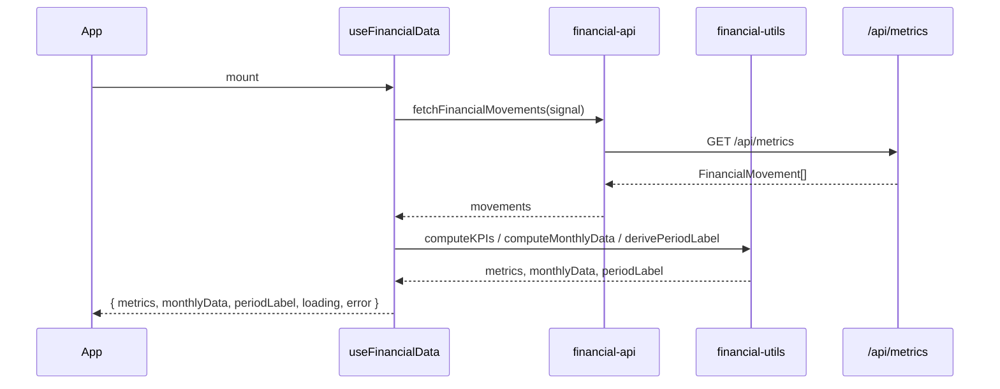

# Frontend — Registro de cambios y convenciones

Este documento registra **qué cambiamos en el frontend, por qué y dónde**. Las reglas operativas para agentes y desarrolladores viven en [`.agents/rules/`](../.agents/rules/).

---

## Estructura actual

```text
frontend/src/
├── api/                 # Llamadas HTTP tipadas
│   └── financial-api.ts
├── hooks/               # Estado y efectos reutilizables
│   └── useFinancialData.ts
├── components/
│   ├── dashboard/       # UI del panel financiero
│   └── ui/              # Primitivos (shadcn-style)
├── lib/                 # Tipos, utilidades puras y tests
├── App.tsx              # Composición del dashboard (sin lógica de datos)
└── main.tsx
```

---

## Changelog (justificado)

### 2026-06-04 — Mejora de accesibilidad y fluidez operativa

| Cambio                                          | Archivos                                                                                                                                                                                           | Justificación                                                                                                                                                                                         |
| ----------------------------------------------- | -------------------------------------------------------------------------------------------------------------------------------------------------------------------------------------------------- | ----------------------------------------------------------------------------------------------------------------------------------------------------------------------------------------------------- |
| Navegación más accesible y foco visible global  | `src/App.tsx`, `src/index.css`                                                                                                                                                                     | Se añade skip link, `aria-busy`, estado de carga para lectores de pantalla, estilos `:focus-visible` y soporte `prefers-reduced-motion` para cumplir WCAG 2.2 en navegación por teclado y movimiento. |
| Mejoras de accesibilidad en tarjetas y gráficos | `src/components/dashboard/kpi-card.tsx`, `src/components/dashboard/dashboard-header.tsx`, `src/components/dashboard/income-outcome-chart.tsx`, `src/components/dashboard/profit-percent-chart.tsx` | Iconos decorativos marcados como no anunciables, estados vacíos con `role="status"` y gráficos con etiquetas semánticas + `accessibilityLayer`.                                                       |
| Optimización de cálculo de KPIs                 | `src/lib/financial-utils.ts`                                                                                                                                                                       | Se reemplaza doble `filter + reduce` por un solo bucle para reducir trabajo en runtime y seguir mejores prácticas de rendimiento.                                                                     |
| Code splitting en gráficos                      | `src/App.tsx`                                                                                                                                                                                      | `React.lazy` + `Suspense` para cargar gráficos bajo demanda y reducir el tamaño del bundle principal.                                                                                                 |

### 2026-06-01 — Entregables de especificacion final

| Cambio                                        | Archivos                                                                               | Justificación                                                                                                                 |
| --------------------------------------------- | -------------------------------------------------------------------------------------- | ----------------------------------------------------------------------------------------------------------------------------- |
| Contrato frontend para nuevas funcionalidades | `specs/api-types.ts`, `specs/param-types.ts`, `specs/components.md`, `specs/README.md` | Cierre del proyecto con definicion formal de tipos, parametros, componentes y edge cases para F1/F2/F3, alineado con `/docs`. |

### 2026-05-29 — Proxy configurable para dev local y Docker

| Cambio                  | Archivos                               | Justificación                                                                                                                                                 |
| ----------------------- | -------------------------------------- | ------------------------------------------------------------------------------------------------------------------------------------------------------------- |
| Proxy Vite configurable | `vite.config.ts`, `docker-compose.yml` | El target fijo `backend:8000` solo funciona en Docker. Default `localhost:8000` para dev manual; Compose inyecta `VITE_API_PROXY_TARGET=http://backend:8000`. |

### 2026-05-29 — Refactor de arquitectura y calidad

| Cambio                      | Archivos                                      | Justificación                                                                                                             |
| --------------------------- | --------------------------------------------- | ------------------------------------------------------------------------------------------------------------------------- |
| Capa API separada           | `src/api/financial-api.ts`                    | `App.tsx` mezclaba fetch y UI. Centralizar HTTP facilita mocks, filtros futuros y un solo punto para `VITE_API_BASE_URL`. |
| Hook de datos               | `src/hooks/useFinancialData.ts`               | El estado (`loading`, `error`, KPIs, gráficos) pertenece a un hook reutilizable, no al componente raíz.                   |
| `App.tsx` simplificado      | `src/App.tsx`                                 | Solo compone layout y pasa props. Más fácil de leer y testear.                                                            |
| Cleanup en fetch            | `useFinancialData.ts`                         | `AbortController` + flag `cancelled` evitan `setState` tras desmontar (StrictMode y navegación).                          |
| Errores trazables           | `useFinancialData.ts`                         | Se registra el error real con `console.error`; el usuario ve un mensaje estable en inglés.                                |
| Periodo dinámico            | `derivePeriodLabel()` en `financial-utils.ts` | El badge del header refleja el rango real de los movimientos, no un string fijo `"2024 - Full Year"`.                     |
| Tooltip compartido          | `chart-tooltip.tsx`                           | Eliminada duplicación entre `income-outcome-chart` y `profit-percent-chart`.                                              |
| `CardTitle` semántico       | `components/ui/card.tsx`                      | Cambio de `<div>` a `<h3>` para jerarquía de headings accesible (h1 en header, h3 en tarjetas).                           |
| Import de React en Skeleton | `components/ui/skeleton.tsx`                  | Consistencia con `card.tsx` y uso correcto de `React.ComponentProps`.                                                     |
| Código muerto eliminado     | ~~`lib/mock-data.ts`~~                        | No se importaba en ningún sitio; la fuente de verdad es `/api/metrics`.                                                   |
| Título de página            | `index.html`                                  | `"Financial Metrics Dashboard"` en lugar de `"frontend"`.                                                                 |
| Alerta accesible            | `App.tsx`                                     | `role="alert"` en el banner de error.                                                                                     |
| Tests de periodo            | `financial-utils.test.ts`                     | Cobertura de `derivePeriodLabel` para año completo y rangos parciales.                                                    |

**Reglas asociadas:** ver [`.agents/rules/frontend-architecture.md`](../.agents/rules/frontend-architecture.md), [`.agents/rules/frontend-data-fetching.md`](../.agents/rules/frontend-data-fetching.md), [`.agents/rules/frontend-ui-components.md`](../.agents/rules/frontend-ui-components.md) y [`.agents/rules/frontend-code-standards.md`](../.agents/rules/frontend-code-standards.md).

---

## Cómo ejecutar

```bash
# Desde la raíz del monorepo
docker compose up --build

# Solo frontend (requiere backend en :8000 o proxy)
cd frontend
npm install
npm run dev
```

| Comando         | Uso                      |
| --------------- | ------------------------ |
| `npm run dev`   | Servidor Vite en `:5173` |
| `npm run test`  | Vitest (utilidades)      |
| `npm run lint`  | ESLint                   |
| `npm run build` | Build de producción      |

---

## Flujo de datos actual



---

## Próximos cambios previstos

Documentar aquí cada mejora futura con la misma tabla **Cambio | Archivos | Justificación**:

- Filtros de fecha/categoría en UI → `useFinancialData` aceptará params; `financial-api.ts` enviará query strings.
- Tests de componentes con Testing Library → `KPIRow`, gráficos, estado error/loading.
- Toggle de tema claro/oscuro → hook `useTheme` en lugar de `className="dark"` fijo en `App.tsx`.

---

## Referencias

- Reglas para agentes: [`../.agents/rules/`](../.agents/rules/)
- Guía general del repo: [`../AGENTS.md`](../AGENTS.md)
- README principal: [`../README.es.md`](../README.es.md)
